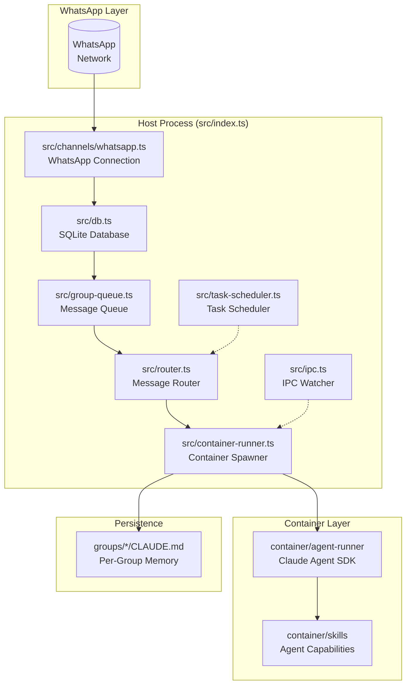
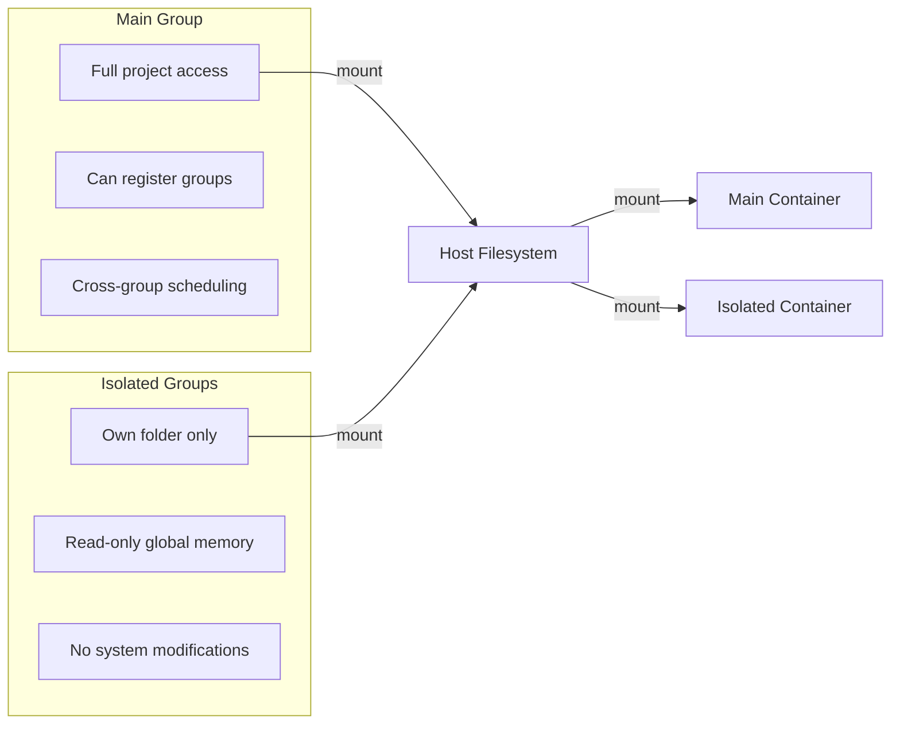

# NanoClaw Architecture Overview

NanoClaw is a personal AI assistant that connects Claude Code to WhatsApp through a single Node.js host process that spawns containerized agent instances. This document provides a focused architectural overview emphasizing the role of each file rather than implementation details.

## Core Design Principles

| Principle                | Implementation                                                          |
| ------------------------ | ----------------------------------------------------------------------- |
| **Minimal codebase**     | ~10 TypeScript files in `src/`, single process, no microservices        |
| **Container isolation**  | Agents run in Docker or Apple Container with explicit volume mounts     |
| **AI-native operations** | Setup via `/setup` skill, debugging via `/debug` skill, no config files |

## System Architecture



## File Roles

### Core Orchestration

| File                             | Role                                                                                                                                     |
| -------------------------------- | ---------------------------------------------------------------------------------------------------------------------------------------- |
| [`src/index.ts`](src/index.ts)   | **Main orchestrator** - Entry point, message loop, agent invocation, state management. Maintains in-memory cursors for message recovery. |
| [`src/router.ts`](src/router.ts) | **Message formatter and outbound router** - Formats messages for containers, routes responses back to WhatsApp                           |

### Communication Channels

| File                                                   | Role                                                                                                                    |
| ------------------------------------------------------ | ----------------------------------------------------------------------------------------------------------------------- |
| [`src/channels/whatsapp.ts`](src/channels/whatsapp.ts) | **WhatsApp connection handler** - Baileys library integration for sending/receiving messages, authentication management |

### Message Processing

| File                                       | Role                                                                                                                                   |
| ------------------------------------------ | -------------------------------------------------------------------------------------------------------------------------------------- |
| [`src/group-queue.ts`](src/group-queue.ts) | **Per-group message queue** - Manages concurrent message processing with global concurrency limits, prevents cross-group contamination |
| [`src/ipc.ts`](src/ipc.ts)                 | **IPC watcher** - Monitors filesystem-based IPC for agent output streaming and tool execution results                                  |

### Container Management

| File                                                                                         | Role                                                                                                                             |
| -------------------------------------------------------------------------------------------- | -------------------------------------------------------------------------------------------------------------------------------- |
| [`src/container-runner.ts`](src/container-runner.ts)                                         | **Container spawner** - Launches agent containers with appropriate volume mounts, handles streaming, manages container lifecycle |
| [`src/container-runtime.ts`](src/container-runtime.ts)                                       | **Runtime abstraction** - Abstracts Docker vs Apple Container differences                                                        |
| [`container/agent-runner/src/index.ts`](container/agent-runner/src/index.ts)                 | **Agent SDK wrapper** - Runs Claude Agent SDK inside container, handles MCP tool communication                                   |
| [`container/agent-runner/src/ipc-mcp-stdio.ts`](container/agent-runner/src/ipc-mcp-stdio.ts) | **MCP stdio bridge** - Connects MCP tools to agent via stdin/stdout                                                              |

### Data Persistence

| File                             | Role                                                                                                                             |
| -------------------------------- | -------------------------------------------------------------------------------------------------------------------------------- |
| [`src/db.ts`](src/db.ts)         | **SQLite operations** - Stores messages, groups, sessions, scheduled tasks. Provides recovery via cursor-based message retrieval |
| [`src/config.ts`](src/config.ts) | **Configuration loader** - Trigger patterns, paths, intervals, mount allowlists                                                  |

### Scheduling & Tasks

| File                                             | Role                                                                                     |
| ------------------------------------------------ | ---------------------------------------------------------------------------------------- |
| [`src/task-scheduler.ts`](src/task-scheduler.ts) | **Scheduled task runner** - Executes recurring jobs (e.g., "send daily briefing at 9am") |

### Security & Isolation

| File                                             | Role                                                                                             |
| ------------------------------------------------ | ------------------------------------------------------------------------------------------------ |
| [`src/mount-security.ts`](src/mount-security.ts) | **Mount validation** - Validates additional mounts against allowlist, prevents self-modification |

### Authentication

| File                                           | Role                                                                        |
| ---------------------------------------------- | --------------------------------------------------------------------------- |
| [`src/whatsapp-auth.ts`](src/whatsapp-auth.ts) | **WhatsApp authentication** - QR code and pairing code authentication flows |

### Types & Utilities

| File                             | Role                                                                          |
| -------------------------------- | ----------------------------------------------------------------------------- |
| [`src/types.ts`](src/types.ts)   | **Core type definitions** - Message, Group, Session, ScheduledTask interfaces |
| [`src/logger.ts`](src/logger.ts) | **Logging configuration** - Pino logger setup                                 |
| [`src/env.ts`](src/env.ts)       | **Environment variable handling**                                             |

### Skills Engine

| File                                                       | Role                                                  |
| ---------------------------------------------------------- | ----------------------------------------------------- |
| [`skills-engine/index.ts`](skills-engine/index.ts)         | **Skills CLI entry point**                            |
| [`skills-engine/apply.ts`](skills-engine/apply.ts)         | **Skill application** - Applies skill transformations |
| [`skills-engine/uninstall.ts`](skills-engine/uninstall.ts) | **Skill removal** - Removes applied skills            |
| [`skills-engine/update.ts`](skills-engine/update.ts)       | **Core version updates**                              |
| [`skills-engine/state.ts`](skills-engine/state.ts)         | **State management** - Tracks applied skills          |
| [`skills-engine/manifest.ts`](skills-engine/manifest.ts)   | **Skill manifest parsing**                            |

### Container Build

| File                                           | Role                                                       |
| ---------------------------------------------- | ---------------------------------------------------------- |
| [`container/build.sh`](container/build.sh)     | **Container image builder** - Builds agent container image |
| [`container/Dockerfile`](container/Dockerfile) | **Container definition** - Agent runtime environment       |

### Group Memory

| File                                                 | Role                                                                     |
| ---------------------------------------------------- | ------------------------------------------------------------------------ |
| [`groups/main/CLAUDE.md`](groups/main/CLAUDE.md)     | **Main group context** - System instructions and memory for main channel |
| [`groups/global/CLAUDE.md`](groups/global/CLAUDE.md) | **Global context** - Shared instructions available to all groups         |

## Data Flow

```mermaid
sequenceDiagram
    participant WA as WhatsApp
    participant WH as whatsapp.ts
    participant DB as db.ts
    participant Loop as index.ts<br/>Message Loop
    participant Queue as group-queue.ts
    participant Router as router.ts
    participant Container as container-runner.ts
    participant Agent as agent-runner

    WA->>WH: Message received
    WH->>DB: storeMessage()

    Loop->>DB: getNewMessages()
    DB-->>Loop: new messages
    Loop->>Loop: update lastTimestamp

    Loop->>Queue: enqueue/send message
    Queue->>Router: format message

    Router->>Container: runContainerAgent()
    Container->>Agent: spawn Claude Agent

    Agent-->>Router: streaming output
    Router->>WA: send response
```

## Container Isolation Model



## Key Concepts

### Dual-Cursor Recovery

- `lastTimestamp` - Global cursor marking all "seen" messages
- `lastAgentTimestamp[jid]` - Per-group cursor for agent-processed messages
- Enables crash recovery by identifying messages stored but not processed

### Group Isolation

- Each WhatsApp group has isolated filesystem (`groups/{folder}/`)
- Own `CLAUDE.md` memory file
- Runs in separate container with only its mounted directories
- Main group has full project access for system management

### Skills System

- Skills are transformation instructions in `.claude/skills/{name}/SKILL.md`
- Executed by Claude Code during conversation
- Keep core codebase minimal while enabling infinite customization
- Examples: `/setup`, `/debug`, `/customize`, `/convert-to-docker`

## Quick Reference

| Component                  | Purpose                                  |
| -------------------------- | ---------------------------------------- |
| `src/index.ts`             | Single source of truth - runs everything |
| `src/db.ts`                | Single source of data - SQLite           |
| `src/channels/whatsapp.ts` | WhatsApp integration                     |
| `src/container-runner.ts`  | Agent container management               |
| `groups/*/CLAUDE.md`       | Per-group persistent memory              |
